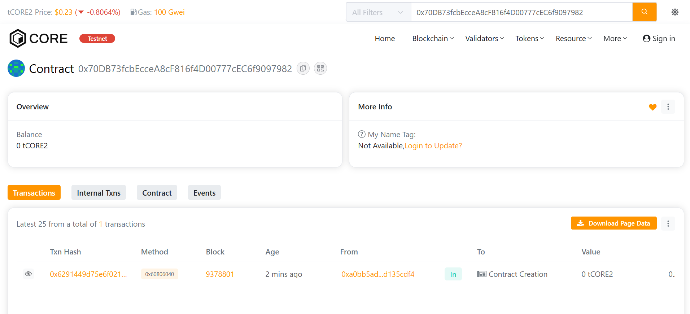

# BlockVerseDAO

## Project Description

BlockVerseDAO is a decentralized autonomous organization (DAO) smart contract built on the Core blockchain that enables transparent and democratic governance for blockchain projects. The platform allows members to create proposals, vote on important decisions, and execute community-driven initiatives in a trustless and decentralized manner.

The smart contract provides a robust framework for managing membership, proposal creation, voting mechanisms, and proposal execution, ensuring that all stakeholders have a voice in the direction of blockchain projects within the ecosystem.

## Project Vision

Our vision is to create a truly decentralized governance platform that empowers communities to collectively make decisions about blockchain projects. BlockVerseDAO aims to:

- **Democratize Decision-Making**: Give every member a proportional voice based on their voting power
- **Ensure Transparency**: All proposals, votes, and executions are recorded on-chain and publicly verifiable
- **Foster Community Engagement**: Encourage active participation in project governance
- **Build Trust**: Eliminate centralized control and create a fair, trustless system
- **Scale Governance**: Provide a foundation for managing complex blockchain projects and initiatives

## Key Features

### 1. **Membership Management**
- Controlled member onboarding by the DAO owner
- Customizable voting power for each member
- Member status tracking (active/inactive)
- Transparent member registry

### 2. **Proposal System**
- Any member can create proposals with title and description
- Automatic deadline management (7-day voting period)
- Proposal tracking and status monitoring
- Unique proposal IDs for easy reference

### 3. **Voting Mechanism**
- Weighted voting based on member's voting power
- One vote per member per proposal
- Support for both "for" and "against" votes
- Vote recording prevents double voting
- Real-time vote tallying

### 4. **Proposal Execution**
- Automatic execution after voting period ends
- Results determined by majority vote
- Execution status tracking
- Event emission for transparency

### 5. **Security Features**
- Owner-controlled member addition
- Member-only proposal creation and voting
- Deadline enforcement
- Double-voting prevention
- Input validation

## Future Scope

### Short-term Enhancements
1. **Token Integration**: Implement native governance tokens for voting power
2. **Quorum Requirements**: Add minimum participation thresholds for proposal validity
3. **Delegation**: Allow members to delegate their voting power to trusted representatives
4. **Multi-signature Execution**: Require multiple approvals for critical proposals

### Medium-term Goals
1. **Treasury Management**: Integrate fund management capabilities for DAO resources
2. **Proposal Categories**: Implement different types of proposals (funding, technical, governance)
3. **Time-locked Execution**: Add delays between approval and execution for security
4. **Proposal Amendments**: Allow proposal creators to modify proposals before voting ends
5. **Reputation System**: Track member participation and contribution history

### Long-term Vision
1. **Cross-chain Governance**: Enable governance across multiple blockchain networks
2. **AI-assisted Analysis**: Integrate tools to analyze proposal impacts
3. **Automated Compliance**: Build-in regulatory compliance checks
4. **Sub-DAOs**: Create hierarchical governance structures for complex organizations
5. **Integration Marketplace**: Connect with DeFi protocols, NFT platforms, and other dApps
6. **Advanced Voting Mechanisms**: Implement quadratic voting, conviction voting, and other advanced systems

---

## Installation & Setup

### Prerequisites
- Node.js v16 or higher
- npm or yarn
- Core Testnet 2 wallet with test CORE tokens

### Installation Steps

1. **Clone the repository**
```bash
git clone <repository-url>
cd blockversedao
```

2. **Install dependencies**
```bash
npm install
```

3. **Configure environment**
Create a `.env` file in the root directory:
```
PRIVATE_KEY=your_private_key_here
```

4. **Compile contracts**
```bash
npm run compile
```

5. **Deploy to Core Testnet 2**
```bash
npm run deploy
```

## Usage

### Deploying the Contract
```bash
npx hardhat run scripts/deploy.js --network coreTestnet2
```

### Interacting with the Contract

**Add a Member:**
```javascript
await project.addMember("0xMemberAddress", 50);
```

**Create a Proposal:**
```javascript
await project.createProposal(
  "Upgrade Protocol to V2",
  "This proposal suggests upgrading our protocol to version 2 with improved features"
);
```

**Vote on a Proposal:**
```javascript
await project.vote(1, true); // Vote 'for' proposal ID 1
```

**Execute a Proposal:**
```javascript
await project.executeProposal(1);
```

## Smart Contract Functions

### Core Functions

1. **addMember(address _member, uint256 _votingPower)** - Add new DAO member
2. **createProposal(string _title, string _description)** - Create a new proposal
3. **vote(uint256 _proposalId, bool _support)** - Cast vote on a proposal

### View Functions
- `getProposal(uint256 _proposalId)` - Get proposal details
- `getMember(address _member)` - Get member information
- `hasVotedOnProposal(uint256 _proposalId, address _voter)` - Check if address has voted

## Network Configuration

**Core Testnet 2**
- RPC URL: https://rpc.test2.btcs.network
- Chain ID: 1115
- Network Name: Core Testnet 2

## Project Structure

```
blockversedao/
├── contracts/
│   └── Project.sol
├── scripts/
│   └── deploy.js
├── test/
├── .env
├── .gitignore
├── hardhat.config.js
├── package.json
└── README.md
```

Address: 0xa0bb5ad19b2966518d3b196f219dbe87d135cdf4

